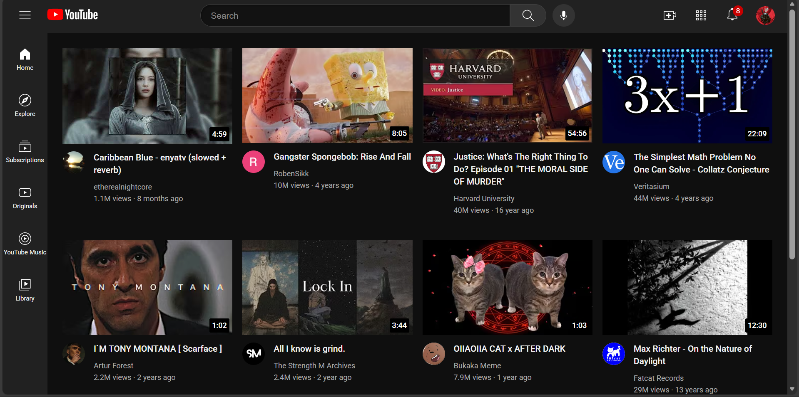
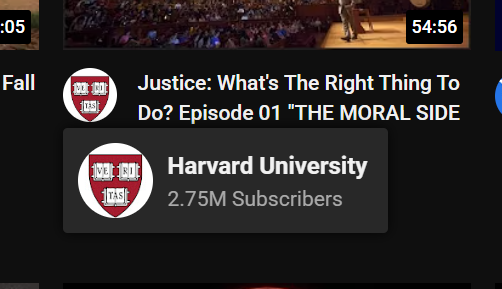
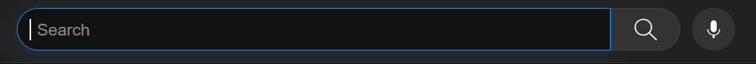

# YouTube Clone (Academic)

A static reproduction of the YouTube homepage. This poject is used for learning front-end layout, responsive grids, and UI details (tooltips, overlays, flexboxes etc).

## Screenshot

## Features
- Responsive video grid (1–4 columns depending on screen width)
- Thumbnail overlays and clickable invisible anchors linking to videos
- Channel profile tooltips on hover

- Search bar with improved focus styling and placeholder

## Files
- `youtube.html` — main page (open in browser).
- `styles/` — CSS files: `general.css`, `header.css`, `video.css`, `sidebar.css`.
- `thumbnails/` — example thumbnails (images).
- `channel-pictures/` — channel/profile images.
- `icons/` — header and sidebar icons.

## Run
1. Clone the repo.
2. Open `youtube.html` in your browser.

## License
For academic/demo use only

---