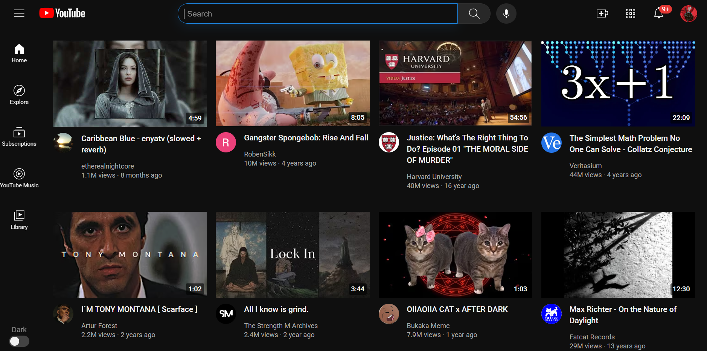
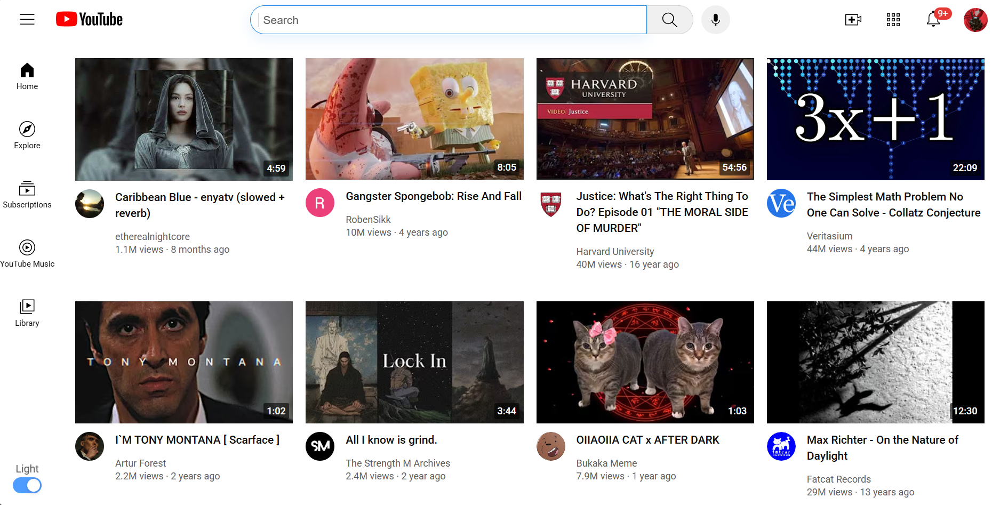
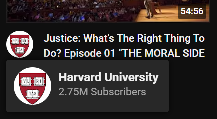

# YouTube Clone (Academic)

A reproduction of the YouTube homepage (for now) built with pure HTML, CSS, and vanilla JavaScript. This project is used for learning front-end layout, responsive grids, CSS theming, and UI details (tooltips, overlays, flexboxes, etc.).

## Screenshot

### Dark Theme (default)


### Light Theme


## Features

- **Dark / Light theme toggle** — switch between themes via a toggle in the sidebar; colors, icons, and the YouTube logo update automatically
- **CSS custom properties** — all theme colors defined as `--variables` in `:root` / `body.light-theme` for easy customization
- **Thumbnail overlays** — video duration badge, clickable invisible anchors linking to real YouTube videos
- **Channel profile tooltips** — hover over a channel picture to see subscriber count and channel name 



## Project Structure

```
YouTube-Clone/
├── youtube.html            — main page (open in browser)
├── theme-toggle.js         — dark/light theme switch logic + logo swap
├── styles/
│   ├── normalize.css       — CSS reset by necolas
│   ├── general.css         — :root variables, body defaults
│   ├── header.css          — fixed header, search bar, tooltips
│   ├── sidebar.css         — sidebar nav, theme toggle switch
│   └── video.css           — video grid, thumbnails, tooltips
├── icons/                  — SVG icons (header, sidebar, logos)
├── thumbnails/             — video thumbnail images
├── channel-pictures/       — channel/profile avatar images
└── screenshots/            — README screenshots
```

## CSS Theme Variables

All colors are controlled via CSS custom properties declared once in `general.css`:

| Variable | Dark | Light |
|---|---|---|
| `--main-bg` | `#0f0f0f` | `#ffffff` |
| `--main-text` | `#f1f1f1` | `#0f0f0f` |
| `--secondary-bg` | `#282828` | `#f0f0f0` |
| `--border-color` | `#333333` | `#d0d0d0` |
| `--hover-bg` | `#3a3a3a` | `#e5e5e5` |
| `--muted-text` | `#888888` | `#606060` |
| `--secondary-text` | `#aaaaaa` | `#606060` |
| `--icon-filter` | `brightness(0.9) invert(1)` | `none` |

## How to Run

1. Clone the repo
2. Open `youtube.html` in your browser
3. Toggle the switch at the bottom of the sidebar to change theme


## License

For academic/demo use only